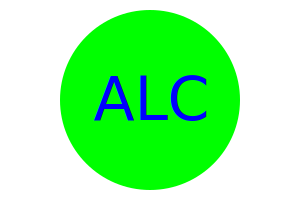

# SVG Logo Maker  

## Description

This is a Node.js command-line application that takes in user input to generate a logo and save it as an SVG file. The application prompts the user to select a color and shape, provide text for the logo, and save the generated SVG to a .svg file.

## Table of Contents

- [Installation](#installation)
- [Usage](#usage)
- [Contribute](#how-to-contribute)
- [Questions/Contact](#questions)

## Installation

1. <u>Project initialization</u>: Create a new project directory and create a new node.js project folder. Clone project "code" from GitHub repo and clone it down into your project folder.

2. <u>Install Dependencies</u>: Open project terminal and use the command npm i to install the required libraries.

3. <u>Run the application</u>: To invoke the application in your terminal, use the command node index.js and follow the prompt.

## Usage

You can utilize the inquirer-based application to generate a simple logo for your projects so that you don't have to pay a graphic designer.

[Walkthrough video link](https://drive.google.com/file/d/1jgl9_uwQXjhocPaFKiaU2EMhKSNe1saS/view?usp=sharing)

## Badges

   

## How to Contribute

If you would like to contribute, please refer to the Contributor Covenant guidelines on how to do so.

The [Contributor Covenant](https://www.contributor-covenant.org/).

## Questions

[Link to GitHub Profile](https://github.com/mandi7469)

If you have additional questions please email me at mandi7469@aol.com